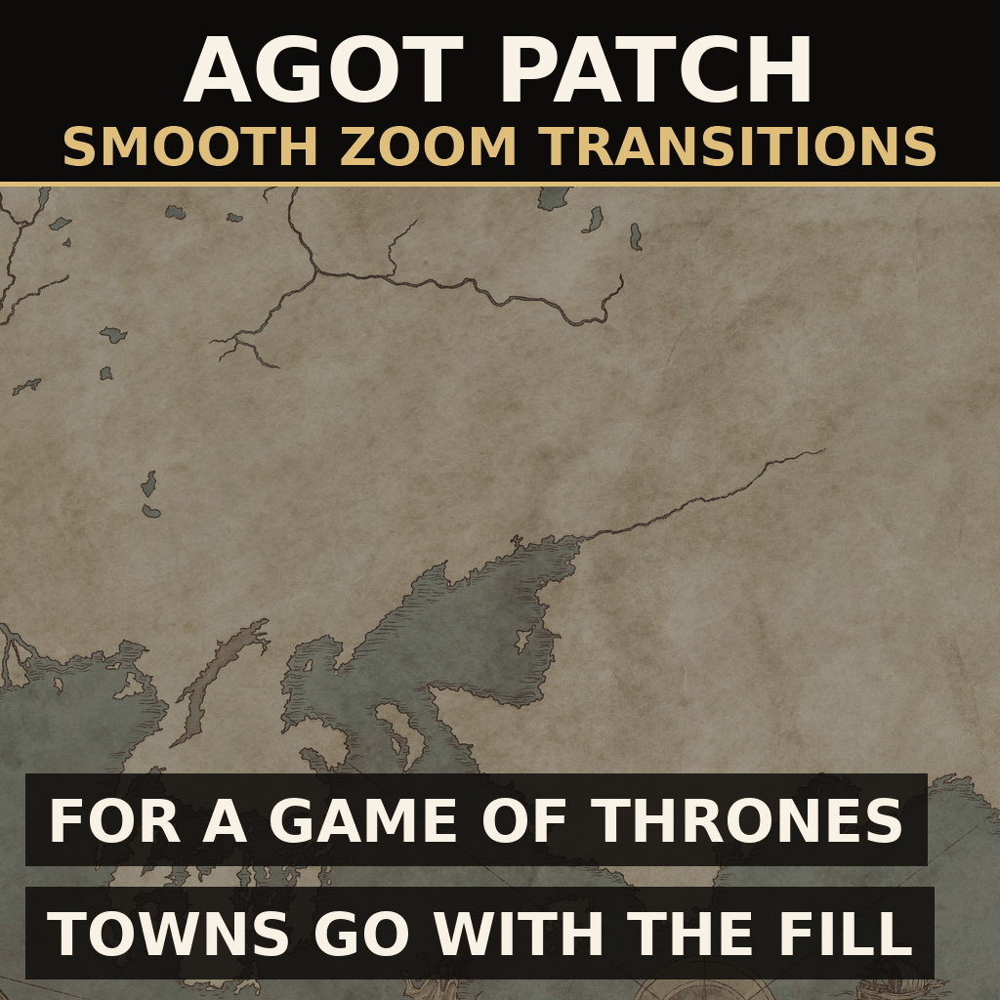

# AGOT Patch for Smooth Zoom Transitions (CK3)

Патч совместимости, с которым
[Smooth Zoom Transitions](https://github.com/mekedron/ck3-zoom-transition-fix)
работает на карте тотальной конверсии
[A Game of Thrones](https://steamcommunity.com/sharedfiles/filedetails/?id=2962333032).
Без него базовый мод, стоящий ниже AGOT, убирает с карты AGOT все модели владений на
8-м шаге зума — задолго до того, как карту начинает заливать цвет королевств, — а
дороги, особые здания и животных AGOT оставляет на слоях, которых его таблица не
объявляет. Заодно патч не даёт AGOT рисовать все модели владений до 16-го шага,
глубоко в закрашенной политической карте: они уходят на 12-м, когда цвет становится виден.

## Почему AGOT нужен патч

Smooth Zoom Transitions подобран под ванильный зум и несёт полную копию ванильного
`gfx/map/map_object_data/game_object_layers.txt` с тремя слоями, снятыми с 9-го шага.
AGOT заменяет тот же файл и камеру за ним, и эти две версии не сходятся:

| | ваниль | Smooth Zoom | AGOT |
| --- | --- | --- | --- |
| `building_layer` выгружается на шаге | 9 | 8 | **16** |
| слоёв в файле | 3 | 3 | **7** (добавлены `AGOT_building_layer`, `AGOT_roads`, `AGOT_low_roads`, `AGOT_animal_layer`) |
| высота камеры на шагах 8 / 9 / 16 | 344 / 396 / 865 | те же | **250 / 300 / 793** (`ZOOM_STEPS` в `common/defines/graphic/00_graphics.txt`) |
| крупные названия с шага | 9 | 11 | **12** |

Поэтому с AGOT выше Smooth Zoom побеждает таблица Smooth Zoom, и:

* владения выгружаются на 8-м шаге, на высоте 250 по камере AGOT, тогда как AGOT
  держит их до 16-го. Заливка цветом у AGOT начинается только на 9-м шаге (на 10-м с
  базовым модом), так что города и деревни пропадают с карты, которая ещё остаётся
  обычным ландшафтом;
* 64 особых здания (мост Пайка, замки Стены, Мост Черепов...), 74 объекта дорог и 21
  объект животных оказываются на слоях, которых таблица не объявляет. Что движок
  делает с объектами на необъявленном слое, здесь не проверялось; в лучшем случае они
  теряют свой шаг исчезновения.

С AGOT *ниже* Smooth Zoom побеждает таблица AGOT, и со зданиями всё в порядке, но
разгрузка 9-го шага из базового мода до слоёв AGOT не доходит, а его шаг названий (11)
перекрывает шаг AGOT (12) при любом порядке модов, потому что файлы defines читаются в
порядке имён.

## Что такое патч

Две таблицы слоёв и один файл defines: числа AGOT, к которым применена идея базового
мода. Ничто из того, что AGOT выгружает на 9-м шаге вместе с двумя нижними слоями
деревьев, там не остаётся, а модели владений уходят с приходом заливки, а не шестью
шагами позже.

| файл | что |
| --- | --- |
| `gfx/map/map_object_data/game_object_layers.txt` | семь слоёв AGOT; `activities_layer` 9 → 7, `AGOT_animal_layer` 9 → 8, `unit_layer` 9 → 10, `building_layer`, `AGOT_building_layer`, `AGOT_roads`, `AGOT_low_roads` 16 → 12; плюс новый `AGOT_skybox_layer` на 16 |
| `gfx/map/map_object_data/skyx_skybox.txt` | файл AGOT, где скайбокс перенесён на `AGOT_skybox_layer`, чтобы он держал 16-й шаг AGOT, пока слой зданий, который он делил, уходит на 12-м |
| `gfx/map/map_object_data/effect_layers.txt` | пена у берега 9 → 7, горные эффекты 9 → 8 (базовый мод ставит 6 и 7; камера AGOT на тех же шагах ниже, так что те же высоты здесь на шаг позже) |
| `common/defines/graphic/zz_smooth_zoom_agot.txt` | `LARGE_NAMES_ZOOM_STEP` возвращён к 12, как у AGOT |
| `common/defines/graphic/zz_smooth_zoom_agot_ultrawide.txt.off` | по желанию, см. ниже |

Остальное из базового мода действует на AGOT без изменений и здесь не дублируется:
бюджет стриминга (`MAX_MESHES_LOADED_PER_FRAME` 100 → 50), начало заливки цветом
(9 → 10), иконки крепостей и набегов (9 → 10), иконки плоской карты, интервал
пересборки границ и поиск размещения названий — всё это перекрывает ключи, которые
AGOT держит на ванильных значениях. Поэтому базовый мод должен оставаться включённым.

Оба файла слоёв начинаются с `#`-комментария, где каждое значение стоит рядом со
значением AGOT; `tools/diff_agot.sh` печатает отличия от копии AGOT в Workshop, чтобы
перенести правку после обновления AGOT.

Шаги зума, которыми пользуется патч, по камере AGOT:

| шаг | 6 | 7 | 8 | 9 | 10 | 12 | 16 |
| --- | --- | --- | --- | --- | --- | --- | --- |
| высота камеры | 179 | 210 | 250 | 300 | 355 | 468 | 793 |
| что выгружается / переключается | трава | активности, пена у берега | животные, горные и прочие эффекты окружения | `tree_low`, `tree_medium` | армии, начало заливки цветом (едва заметное), иконки крепостей и набегов, затухание тумана войны AGOT | владения, города, дороги и мосты AGOT, крупные названия | скайбокс, `tree_high` |

### Почему владения уходят на 12-м шаге

AGOT держит `building_layer` до 16-го шага, на высоте 793, когда заливка цветом полностью
непрозрачна уже с 15-го и карта читается как раскрашенная политическая. Каждый замок,
город и храм на экране на такой высоте всё ещё меш, на площади во много раз больше той,
где владения рисует ваниль, и именно там ноутбучная видеокарта с 4 ГБ падала с 60 до 17
FPS на карте AGOT. Заливка начинается на 10-м шаге (базовый мод переносит её туда с 9-го),
но два шага почти прозрачна; на 12-м цвет уже виден, там модели и уходят. Если считать
щелчки колёсика от самого близкого вида как 1, это 13-й щелчок.

Города, расставленные AGOT вручную, — не владения: Браавос, Галтаун, Ланниспорт, Тайрош,
Старомест, Белая Гавань, Пентос, Пайк и замки Стены — это объекты карты на собственном
`AGOT_building_layer`, а мосты и валирийские дороги — на `AGOT_roads` / `AGOT_low_roads`.
Они тоже уходят на 12-м, так что ни один город не переживает заливку, когда Королевская
Гавань и все баронства уже пропали. Скайбокс AGOT делит `AGOT_building_layer`; он вынесен
на собственный слой с 16-м шагом AGOT, иначе море за краем карты теряло бы небо на 12-м.
`fade_out` — одно число на слой в `game_object_layers.txt`, если хочется вернуть что-то
подольше.

Не покрыто: 3D-достопримечательности, которые другие моды добавляют как *ассеты зданий*
(например, Мейденпул из COW-AGOT), рисует система владений, а не слой объектов карты, и
патч не решает, когда они выгружаются.

### Для ультрашироких экранов (по желанию)

Файл по желанию из базового мода режет `NAME_DRAW_DISTANCE` с ванильных 12000 до 9000.
AGOT ставит 20000 под свою большую карту, так что тот файл урезал бы радиус больше чем
вдвое. Вместо него переименуйте `zz_smooth_zoom_agot_ultrawide.txt.off` в `.txt`: он
применяет те же три четверти к значению AGOT (15000) и сортируется после файла базового
мода, так что побеждает, если включены оба.

## Порядок загрузки

    A Game of Thrones
    Smooth Zoom Transitions          (где угодно; выше или ниже AGOT — работает и так, и так)
    AGOT Patch for Smooth Zoom Transitions   (ниже AGOT)

Важна только последняя строка: патч заменяет файл слоёв AGOT, поэтому должен стоять
ниже AGOT. Файлы defines обоих модов подхватываются при любом положении.

## Структура

    descriptor.mod                              метаданные мода
    thumbnail.png                               превью для Workshop, в корне мода
    common/defines/graphic/zz_smooth_zoom_agot.txt   шаг названий
    common/defines/graphic/zz_*_ultrawide.txt.off    радиус названий, по желанию
    gfx/map/map_object_data/game_object_layers.txt   слои объектов AGOT, перенастроенные
    gfx/map/map_object_data/effect_layers.txt        слои эффектов, перенастроенные
    install.sh                                  копирует мод в Proton-префикс
    tools/check_log.sh                          проверка монтирования и error.log после запуска
    tools/diff_agot.sh                          diff с копией AGOT из Workshop
    tools/bbcode_to_plain.py                    генерирует тексты для Paradox Mods
    steam-workshop/                             тексты для листинга и генератор превью

## Установка

Запустите `./install.sh`. Он копирует мод в папку модов CK3 внутри Proton-префикса.
Затем в плейсете лаунчера включите его ниже A Game of Thrones, вместе со Smooth Zoom
Transitions. Шейдеры не затронуты, пересборки нет; изменение видно на первом же зуме.

## Кодировка файлов

Каждый `.txt` здесь начинается с UTF-8 BOM, как файлы ванили и AGOT. Без него игра их
всё равно читает, но пишет по строке `should be in utf8-bom encoding` на файл.

## Версия игры

Собран под CK3 1.19.0.6 (Scribe), AGOT 0.5.2.1 и Smooth Zoom Transitions 1.0.0. После
релиза AGOT запустите `tools/diff_agot.sh`: если AGOT изменил список слоёв или свои
`ZOOM_STEPS`, обеим таблицам здесь нужна та же правка.

## Мультиплеер / достижения

Слои объектов карты и графические defines не входят в контрольную сумму, но лаунчер всё
равно помечает любой мод как мод. Относитесь к нему как к любому графическому моду.
